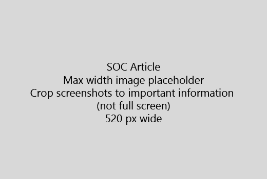

Sākt savu rakstu ar ļoti īsu ievadu (1 teikums). Put sevi lasītāja vieta - kāpēc viņi ir šeit? Ko viņi dara? 
  
1. Iegūt tieši, lai ātri soļi, lai paveiktu uzdevumu sarakstu.
    
    Ja jums ir nepieciešams, lai izskaidrotu koncepcija, vai tie ir sākotnēji nepieciešamie soļi, pievienot zem solis, kur tām ir nepieciešama to un [saiti](https://support.office.com/article/f37e7984-cf03-4fde-92d3-82970d7e241b.aspx) uz koncepcijas vai darbības īss kopsavilkums. 
    
2. Glabā procedūras īss - vēlams 5 vai mazāk soļu, ne vairāk kā 8.
    
3. **Lietotāja interfeisa stila** lietošana lietotāja interfeisa elementus vai teksta personām nepieciešams ievadīt. 
    
4. Verbi izvēlēties, izvēlēties, vai ievadīt kā darbības un izvēlnes Formatēt kā **izvēlnes** izmantošana \> **komandu**.
    
5. Pēc izvēles pievienojiet screenshot konteksta (ja UI ir grūti atrast, vai tas ir nepieciešams, lai pabeigtu uzdevumu).
    
    Maksimālais platums: 520 pikseļi. Izmantot standarta dizainu, nevar parādīt nekādu personisku informāciju un apgriezt, lai parādītu tikai to, kas ir attiecīgo. 
    
    
  
Ja vēlaties pievienot video vai screenshot, lietot divu kolonnu režģis un darbības kreisi un video vai attēlā, pa labi - redzēt [soļus un video tīkla piemērs](https://support.office.com/article/14ce8e82-efa0-47f5-bb84-94f078db3dae.aspx). 
  
Norādīt ne vairāk kā 500 vārdu rakstu.
  
# Piemērs rakstu

[Mainīt manu foto](https://support.office.com/article/555376e0-1fca-49ba-8434-307a0525c767.aspx)
  

