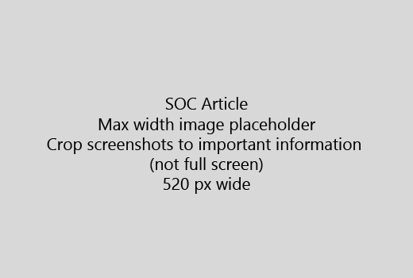

Sākt savu rakstu ar ļoti īsu ievadu (1 teikums). Put sevi lasītāja vieta - kāpēc viņi ir šeit? Ko viņi dara?Start your article with a very short introduction (1 sentence). Put yourself in the reader's place - why are they here? What should they do? 
  
1. Iegūt tieši, lai ātri soļi, lai paveiktu uzdevumu sarakstu.Get straight to a quick list of steps to accomplish the task.
    
    Ja jums ir nepieciešams, lai izskaidrotu koncepcija, vai tie ir sākotnēji nepieciešamie soļi, pievienot zem solis, kur tām ir nepieciešama to un [saiti](https://support.office.com/article/f37e7984-cf03-4fde-92d3-82970d7e241b.aspx) uz koncepcijas vai darbības īss kopsavilkums.If you need to explain a concept, or they have to do pre-requisite steps, add a quick summary below the step where they need it, and [link](https://support.office.com/article/f37e7984-cf03-4fde-92d3-82970d7e241b.aspx) to the concept or steps. 
    
2. Glabā procedūras īss - vēlams 5 vai mazāk soļu, ne vairāk kā 8.Keep procedures short - preferably 5 or fewer steps, no more than 8.
    
3. **Lietotāja interfeisa stila** lietošana lietotāja interfeisa elementus vai teksta personām nepieciešams ievadīt.Use **Ui style** for user interface elements or for text people need to enter. 
    
4. Verbi izvēlēties, izvēlēties, vai ievadīt kā darbības un izvēlnes Formatēt kā **izvēlnes** izmantošana \> **komandu**.Use the verbs choose, select, or enter as actions, and format menus as **Menu** \> **Command**.
    
5. Pēc izvēles pievienojiet screenshot konteksta (ja UI ir grūti atrast, vai tas ir nepieciešams, lai pabeigtu uzdevumu).Optionally, add a screenshot for context (if UI is hard to locate, or it's needed to complete the task).
    
    Maksimālais platums: 520 pikseļi. Izmantot standarta dizainu, nevar parādīt nekādu personisku informāciju un apgriezt, lai parādītu tikai to, kas ir attiecīgo.Maximum width: 520 pixels. Use a standard theme, do not show any personal information, and crop to show only what's relevant. 
    
    
  
Ja vēlaties pievienot video vai screenshot, lietot divu kolonnu režģis un darbības kreisi un video vai attēlā, pa labi - redzēt [soļus un video tīkla piemērs](https://support.office.com/article/14ce8e82-efa0-47f5-bb84-94f078db3dae.aspx).If you want to add a video or screenshot, use a two-column grid and have the steps in the left and the video or screenshot in the right - see [Steps and video grid example](https://support.office.com/article/14ce8e82-efa0-47f5-bb84-94f078db3dae.aspx). 
  
Norādīt ne vairāk kā 500 vārdu rakstu.Target no more than 500 words for an article.
  
# Piemērs rakstuExample article

[Mainīt manu fotoChange my photo](https://support.office.com/article/555376e0-1fca-49ba-8434-307a0525c767.aspx)
  

