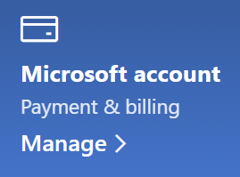

# Sava Microsoft konta informācijas mainīšana

Dodieties uz [https://account.microsoft.com](https://account.microsoft.com/) un pierakstieties, ja nepieciešams. Tiks atvērts jūsu konta informācijas panelis.  

**Sava vārda/nosaukuma un personiskās informācijas rediģēšana**

1. Sava konta informācijas panelī blakus konta attēlam un nosaukumam noklikšķiniet uz daudzpunktes (vairāk darbību), > Rediģēt profilu**.
2. Izmantojiet lapā **Profila rediģēšana** pieejamās saites, lai mainītu savu profila attēlu, vārdu/nosaukumu, dzimšanas datumu, atrašanās vietu un attēlojuma valodas preferenci. Ievērojiet saites uz jūsu Xbox vai Skype kontu profiliem, kuros varat mainīt šo kontu specifisko detalizēto informāciju.

**E-pasta adrešu un tālruņa numuru pārvaldība**

Microsoft kontam kā “aizstājvārds” ir viena vai vairākas ar to saistītās e-pasta adreses vai tālruņa numuri. Lai tos pārvaldītu:

1. Sava konta informācijas panelī blakus konta attēlam un nosaukumam noklikšķiniet uz daudzpunktes (vairāk darbību) un > **Rediģēt profilu.**
2. Lapā **Profila rediģēšana** noklikšķiniet uz **Pārvaldīt, kā pierakstāties Microsoft serverī**. 
3. Tiks parādīts konta aizstājvārdu saraksts, kuru varat pārvaldīt, pievienojot un dzēšot e-pasta adreses un tālruņa numurus. Šeit varat arī atlasīt, kurus aizstājvārdus var izmantot, lai pierakstītos kontā, un kurs aizstājvārds tiek uzskatīts par “primāro”, kas tiek rādīts jūsu Windows 10 ierīcēs.

**Maksāšanas metožu, kā arī vārda/nosaukuma un adreses pārvaldība norēķinu nolūkā** 

1. Sava konta informācijas panelī blakus konta attēlam un nosaukumam noklikšķiniet uz daudzpunktes (vairāk darbību) un > **Rediģēt profilu.**
2. Sadaļā **Maksājumi un norēķini** noklikšķiniet uz **Pārvaldīt**.

    

3. Šeit varat pievienot, rediģēt un noņemt maksājumu metodes un ar tām saistītās norēķinu adreses. 
