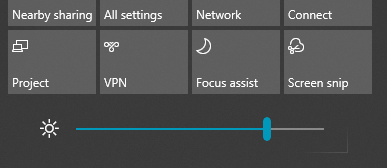

# Ekrāna spilgtuma maiņa operētājsistēmā Windows 10Change screen brightness in Windows 10

Ja jūsu Windows 10 versija ir jaunāka par versiju 1903, darbību centrā tai ir **spilgtuma slīdnis**.If your Windows 10 is newer than version 1903, it has a **Brightness slider** in the action center. Lai atvērtu darbību centru, noklikšķiniet uz **paziņojumu** pogas uzdevumjoslas labajā malā vai nospiediet tastatūras taustiņu kombināciju **Windows sākums+A**.To open the action center, click the **Notification** button at the rightmost side of your taskbar, or press **Windows home + A** on your keyboard.

Ja jūsu Windows 10 versija ir vecāka, spilgtuma slīdni varat atrast, dodoties uz **[Iestatījumi > Sistēma > Displejs](ms-settings:display?activationSource=GetHelp)**.If your Windows 10 is an earlier version, you can find the brightness slider by going to **[Settings > System > Display](ms-settings:display?activationSource=GetHelp)**.

**Piezīmes**.**Notes**:

- Iespējams, neredzēsit spilgtuma mainīšanas opciju iebūvētajam displeja slīdnim personālajā galddatorā, kuram ir ārējais monitors.You might not see the Change brightness for the built-in display slider on desktop PCs that have an external monitor. Lai mainītu ārējā monitora spilgtumu, izmantojiet monitora vadīklas.To change the brightness of an external monitor, use the controls on the monitor.
- Ja jums nav personālā galddatora un slīdnis netiek rādīts vai nedarbojas, mēģiniet atjaunināt displeja draiveri.If you don't have a desktop PC and the slider doesn't appear or work, try updating the display driver. Uzdevumjoslas meklēšanas lodziņā ierakstiet **Ierīču pārvaldnieks** un pēc tam rezultātu sarakstā atlasiet **Ierīču pārvaldnieks**.In the search box on the taskbar, type **Device Manager**, and then select **Device Manager** from the list of results. Rīkā **Ierīču pārvaldnieks** atlasiet **Displeja adapteri** un pēc tam atlasiet displeja adapteri.In **Device Manager**, select **Display adapters**, then select the display adapter. Nospiediet un turiet (vai noklikšķiniet ar peles labo pogu) displeja adaptera nosaukumu un noklikšķiniet uz **Atjaunināt draiveri**; pēc tam izpildiet norādījumus.Press and hold (or right-click) the display adapter name and click **Update driver**; then follow the instructions.
