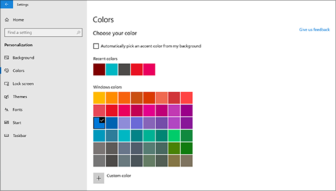
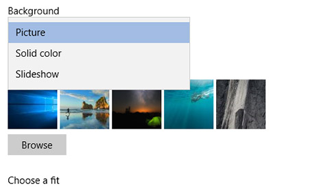

# Darbvirsmas fona un krāsu mainīšana

Lai mainītu krāsu iestatījumu, dodieties uz **sākuma** > **iestatījumu** > **personalizācijas** > **krāsas**un pēc tam izvēlieties savu krāsu vai ļaujiet sistēmai Windows izvilkt izcēluma krāsu no fona.

Lai mainītu darbvirsmas fonu, dodieties uz **sākuma** > **iestatījumu** > **personalizācijas** > **fons**un pēc tam izvēlieties attēlu, tīrtoņa krāsu vai izveidojiet attēlu slaidrādi. 

Vēlaties vairāk darbvirsmas fonu un krāsu? Apmeklējiet [Microsoft Store](https://www.microsoft.com/store/collections/windowsthemes) , lai izvēlētos no desmitiem bezmaksas tēmām.
