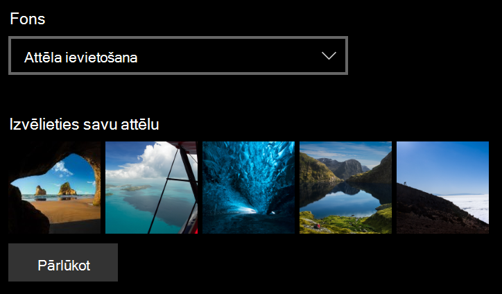
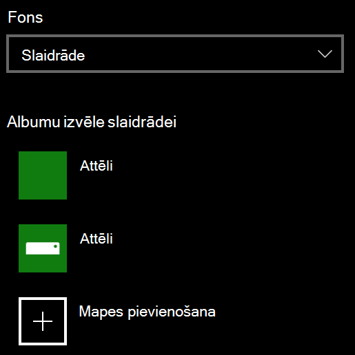

# Bloķēšanas ekrāna fona mainīšana

- Dodieties **uz iestatījumu**  >  **personalizēšanas**  >  **bloķēšanas ekrānu.** Vai arī noklikšķiniet vai pieskarieties [šeit](ms-settings:lockscreen?activationSource=GetHelp).

- Lai iestatītu pielāgotu fona attēlu, **nolaižamajā sarakstā** **Fons** atlasiet Attēls un izvēlieties vai **Pārlūkot** līdz attēlam.

  

- Lai iestatītu pielāgotu attēlu slaidrādi, nolaižamajā sarakstā **Fons** atlasiet Slaidrāde un izvēlieties albumu vai pievienojiet mapi, kurā ir slaidrādes attēli. 

  
