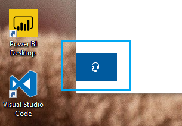

# Sazinieties ar mums, noklikšķinot uz austiņas pogas

Ja vēlaties sazināties ar Microsoft atbalsta dienestu, lūdzu, noklikšķiniet uz **sazināties ar mums** šīs lietojumprogrammas kreisajā apakšējā stūrī. Izlidošanas logā jūs tiksit novirzīts uz pareizo atbalsta kanālu pēc produkta un emisijas kategorijas izvēlēšanās.

Varat turpināt mijiedarboties ar pārējiem programmas pat pēc tam, kad esat sācis sazināties ar mums sesiju. Sazināšanās ar mums panelī var īslaicīgi samazināt, programmā noklikšķinot jebkurā vietā citur. Lai atgrieztos tajā pašā sesijā, vienkārši vēlreiz noklikšķiniet uz **sazināties ar mums** .
