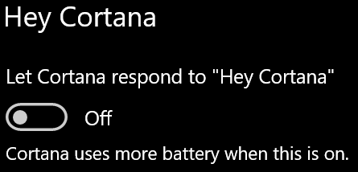

# Cortana nerunā ar mani vai nedzird maniCortana doesn’t talk to me or can’t hear me

Ja mēģināt izmantot līdzekli "Hey Cortana", kas ļauj runāt ar Cortana, neatlasot pogu Cortana uzdevumjoslā vai mikrofona pogu panelī Cortana, apstipriniet, ka līdzeklis ir iespējots.If you are trying to use the "Hey Cortana" feature, which allows you to talk to Cortana without selecting the Cortana button on the taskbar or the microphone button in the Cortana panel, confirm that the feature is enabled:

1. Dodieties uz **Sākums**un pēc tam atlasiet **[Iestatījumi > Cortana](ms-settings:cortana?activationSource=GetHelp)**.Go to **Start**, then select **[Settings > Cortana](ms-settings:cortana?activationSource=GetHelp)**.
2. Sadaļā **Hey Cortana**pārslēdziet pogu **ļaut līdzeklim Cortana reaģēt uz "Hey Cortana"** slēdzi **ieslēgts**.Under **Hey Cortana**, switch the **Let Cortana respond to "Hey Cortana"** toggle to **On**.

**Vai jūsu konfidencialitātes iestatījumi neļauj Cortana jūs dzirdēt?****Are your privacy settings preventing Cortana from hearing you?**

Jūsu konfidencialitātes iestatījumi var neļaut līdzeklim Cortana atbildēt uz jūsu balsi.Your privacy settings can prevent Cortana from responding to your voice.
- Pārbaudiet, vai ir ieslēgta tiešsaistes runas pazīšana:Check to make sure Online Speech recognition is turned on:
    - Dodieties uz **Sākums**un pēc tam noklikšķiniet uz **[iestatījumi > konfidencialitāte > runa](ms-settings:privacy-speech?activationSource=GetHelp)**.Go to **Start**, then click **[Settings > Privacy > Speech](ms-settings:privacy-speech?activationSource=GetHelp)**.
    - Sadaļā **tiešsaistes runas pazīšana**pārslēdziet iestatījumu uz **ieslēgts**.Under **Online speech recognition**, switch the setting to **On**.
- Pārbaudiet, vai līdzeklim Cortana ir atļauja piekļūt jūsu mikrofonam.Check to make sure Cortana has permission to access your microphone. 
    - Dodieties uz Sākums un pēc tam noklikšķiniet uz **[iestatījumi > konfidencialitāte > mikrofons](ms-settings:privacy-microphone?activationSource=GetHelp)**.Go to Start, then click **[Settings > Privacy > Microphone](ms-settings:privacy-microphone?activationSource=GetHelp)**.
    - Sadaļā **izvēlēties, kuras programmas var piekļūt jūsu mikrofonam**meklējiet **Cortana** programmu un pakalpojumu sarakstā un pārliecinieties, vai slēdzis ir **pārslēgts uz ieslēgts**.Under **Choose which apps can access your microphone**, look for **Cortana** within the list of apps and services and make sure the switch is toggled to **On**.

Turklāt, lūdzu, pārliecinieties, ka jūsu skaļruņi vai mikrofoni ir izveidota un strādā, lai runātu ar Cortana.Moreover, please also make sure that your speakers or microphones are up and working in order to talk to Cortana.
