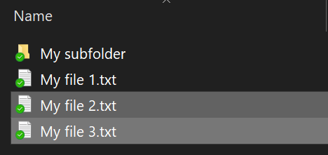
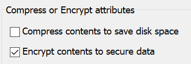

# Failu vai mapes šifrēšana operētājsistēmā Windows 10

Varat šifrēt visu disku, izmantojot BitLocker, bet, lai šifrētu tikai atsevišķus failus vai mapes (un to saturu):

1. **Failu pārlūkā** atlasiet failus/mapes, ko vēlaties šifrēt. Šajā piemērā ir atlasīti divi faili:

    

2. Ar peles labo pogu noklikšķiniet uz atlasītajiem failiem un noklikšķiniet uz **Rekvizīti**.

3. Logā **Rekvizīti** noklikšķiniet uz **Papildu**.

4. Logā **Papildu rekvizīti** atzīmējiet izvēles rūtiņu **Šifrēt saturu, lai drošinātu datus**:

    

5. Noklikšķiniet uz **Labi**.
