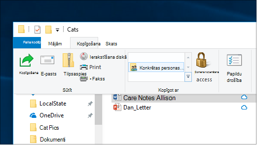
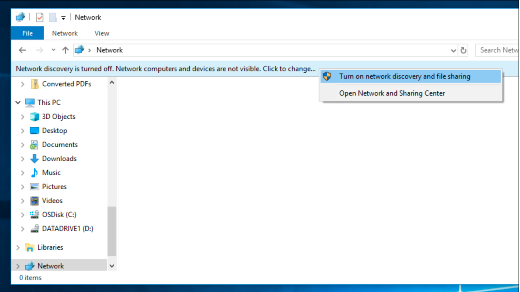

# Failu koplietošana tīklā operētājsistēmā Windows 10File sharing over a network in Windows 10

**Piezīme.** Ja iepriekš izmantojāt mājas grupu failu koplietošanai, ņemiet vērā, ka mājas grupa ir noņemta no Windows 10 (versija 1803).**Note**: If you previously used HomeGroup for file sharing, please note that HomeGroup has been removed from Windows 10 (Version 1803). Tagad varat kopīgot printerus un failus, izmantojot iebūvētos līdzekļus operētājsistēmā Windows 10.You can now share printers and files by using built-in features in Windows 10.

**Failu un mapju koplietošana tīklā****To share files or folders over a network**

- Failu **pārlūkā** atlasiet failu> noklikšķiniet uz  cilnes Koplietošana augšējā > sadaļā **Koplietot ar** noklikšķiniet uz **Noteiktas personas.**In **File Explorer**, select a file > click the **Share** tab at the top > in the **Share with** section, click **Specific people**.

    
          
- Ja vienlaikus atlasāt vairākus failus, varat tos visus kopīgot tādā pašā veidā.If you select multiple files at once, you can share them all in the same way. Tā darbojas arī mapēs.It works for folders, too.

**Lai skatītu tīkla ierīces, kas koplieto failus****To see devices on the network that are sharing files**

- Failu **pārlūkā** dodieties uz **Tīkls**.In **File Explorer**, go to **Network**. Ja tīkla atklāšana nav iespējota, tiks parādīts kļūdas ziņojums "Tīkla atklāšana ir izslēgta..."If Network discovery is not enabled, you will see an error message "Network discovery is turned off..."

- Noklikšķiniet uz **reklāmkaroga Tīkla atklāšana** ir izslēgta, pēc tam noklikšķiniet **uz Ieslēgt tīkla atklāšanu un failu koplietošanu.**Click the **Network discovery is turned off** banner, then click **Turn on network discovery and file sharing**.

    

[Papildinformācija par failu koplietošanu tīklāRead more about file sharing over a network](https://support.microsoft.com/help/4092694/windows-10-file-sharing-over-a-network)

[Failu koplietošana, izmantojot programmas, OneDrive, e-pasta ziņojumus un daudz ko cituShare files using apps, OneDrive, emails, and more](https://support.microsoft.com/help/4027674/windows-10-share-files-in-file-explorer)
