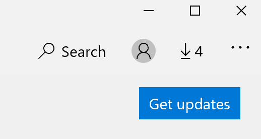

# Programmu parādīšanas valodas labošana

Pēc tam, kad esat mainījis interfeisa valodu operētājsistēmā Windows 10, dažas lietojumprogrammas, atverot tās, joprojām var izmantot iepriekšējo valodu. Tas notiek tāpēc, ka no veikala ir jālejupielādē šīs valodas lietojumprogrammu jaunās versijas. Lai novērstu šo problēmu, varat gaidīt automātisku atjaunināšanu vai arī manuāli instalēt lietojumprogrammu atjaunināto versiju.

Lai manuāli instalētu atjauninājumu, atveriet **Microsoft Store** un augšējā labajā stūrī noklikšķiniet uz **lejupielādes un atjauninājumi** . Pēc tam noklikšķiniet uz **iegūt atjauninājumus**. Ja pēc atjaunināšanas veikšanas valoda netiek mainīta, mēģiniet restartēt datoru.

Lai uzzinātu vairāk par ievades un parādīšanas valodas iestatījumiem, skatiet rakstu [ievades un interfeisa valodas iestatījumu pārvaldība operētājsistēmā Windows 10](https://support.microsoft.com/help/4027670/windows-10-add-and-switch-input-and-display-language-preferences).
