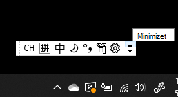
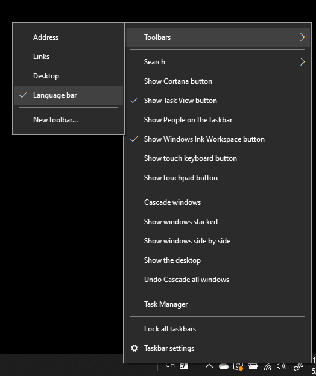
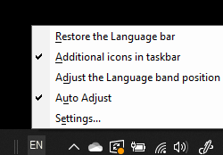

# Valodu joslas paslēpšanas, parādīšanas vai atiestatīšanas

**Lai minimizētu valodu joslu:**

Varat noklikšķināt uz minimizēšanas pogas valodu joslas augšējā labajā stūrī. Vai arī vienkārši velciet valodu joslu uz uzdevumjoslu, kas automātiski to minimizē.

**Lai uznirstošo valodu joslu:**

Ja nevēlaties dokot valodu joslu uzdevumjoslā, ar peles labo pogu noklikšķiniet  uz jebkuras tukšas vietas uzdevumjoslā un noņemiet atzīmi pie valodas joslas opcijas rīkjoslās. Tādējādi valodu josla tiks parādīta ārpus uzdevumjoslas tāpat kā iepriekšējais ekrānuzņēmums.

**Lai atjaunotu valodu joslas noklusējumu:**

Ar peles labo pogu rīkjoslā noklikšķiniet uz valodas pogas un izvēlnē **noklikšķiniet uz** Atjaunot valodu joslas opciju. Tādējādi tā tiks atjaunota uz noklusējuma versiju.

