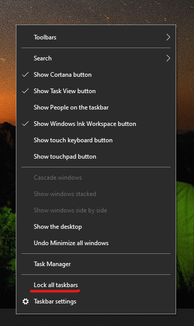

# Uzdevumjoslas pārvietošana uz vienu vai abām darbvirsmas malām vai augšpusi

Vispirms apstipriniet, ka uzdevumjosla ir atbloķēta. Lai noskaidrotu, vai jūsu ierīces ir atbloķētas, ar peles labo pogu noklikšķiniet uz jebkuras tukšās vietas uzdevumjoslā un skatiet, vai blakus **Bloķēt uzdevumjoslu** ir atzīme. Ja ir atzīme, uzdevumjosla ir bloķēta un to nevar pārvietot. Noklikšķinot uz **Bloķēt uzdevumjoslu** vienreiz to atbloķēs un noņems atzīmi.

Ja jums ir vairāki monitori, kas parāda uzdevumjoslu, tiek parādīts **Bloķēt visas uzdevumjoslas**.

Kad uzdevumjosla ir atbloķēta, varat nospiest un turēt tukšu vietu uzdevumjoslā un vilkt to uz vietu, kuru vēlaties redzēt ekrānā. To var izdarīt arī, ar peles labo pogu noklikšķinot uz jebkuras tukšas vietas uzdevumjoslā un pārejot uz **[Uzdevumjoslas iestatījumi](ms-settings:taskbar?activationSource=GetHelp) > Uzdevumjoslas atrašanās vieta ekrānā**.
