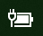

# Windows 10 trūkst enerģijas vai akumulatora ikonas 

Ja jūsu Windows 10 ierīce ir aprīkota ar akumulatoru (piem., klēpjdators vai planšetdators, vai dators, kas ar USB pieslēgts pie UPS ierīces), tad parasti enerģijas/akumulatora ikona ir redzama uzdevumjoslā, blakus pulkstenim, piemēram:

Ja neredzat šo ikonu, tā var būt slēpta:

1. Dodieties uz **[Iestatījumi > Personalizēšana > Uzdevumjosla](ms-settings:taskbar?activationSource=GetHelp)**.

2. Paziņojumu apgabalā noklikšķiniet uz **Atlasīt ikonas, kas parādās uzdevumjoslā**.

3. Pēc tam sarakstā atrodiet vienumu **Enerģija** un pārslēdziet tā iestatījumu uz **Ieslēgts**.

    

**Problēmu novēršana**

Ja sekojāt norādījumiem augstāk un **Enerģijas** pārslēgšanas poga ir pelēkota vai nav redzama, meklēšanas joslā ierakstiet **ierīču pārvaldnieks** un rezultātu sarakstā atlasiet **Ierīču pārvaldnieks**. Sadaļā **Akumulatori** ar labo peles pogu noklikšķiniet uz jūsu ierīces akumulatora, pēc tam noklikšķiniet uz **Atspējot** un noklikšķiniet uz **Jā**. Uzgaidiet pāris sekundes, pēc tam ar labo peles pogu noklikšķiniet uz akumulatora un noklikšķiniet uz **Iespējot**. Pēc tam restartējiet savu ierīci.

Ja sekojāt norādījumiem augstāk, bet akumulatora ikona joprojām neparādās uzdevumjoslā, tad uzdevumjoslas meklēšanas laukā ierakstiet **uzdevumu pārvaldnieks** un pēc tam rezultātu sarakstā noklikšķiniet uz **Uzdevumu pārvaldnieks**. Cilnē **Procesi**, sadaļā **Nosaukums**, ar labo peles pogu noklikšķiniet uz **Pārlūks** un pēc tam noklikšķiniet uz **Restartēt**.
