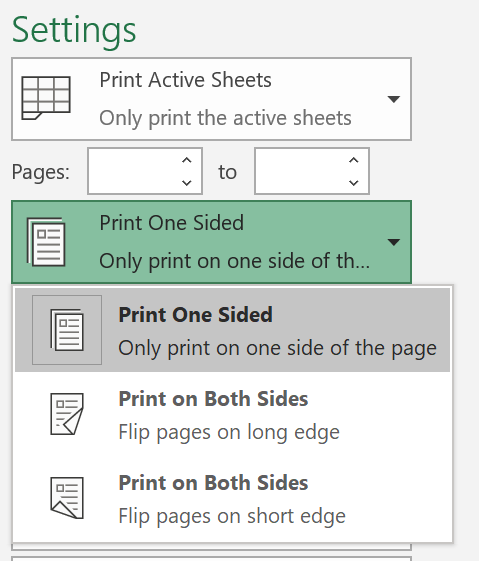
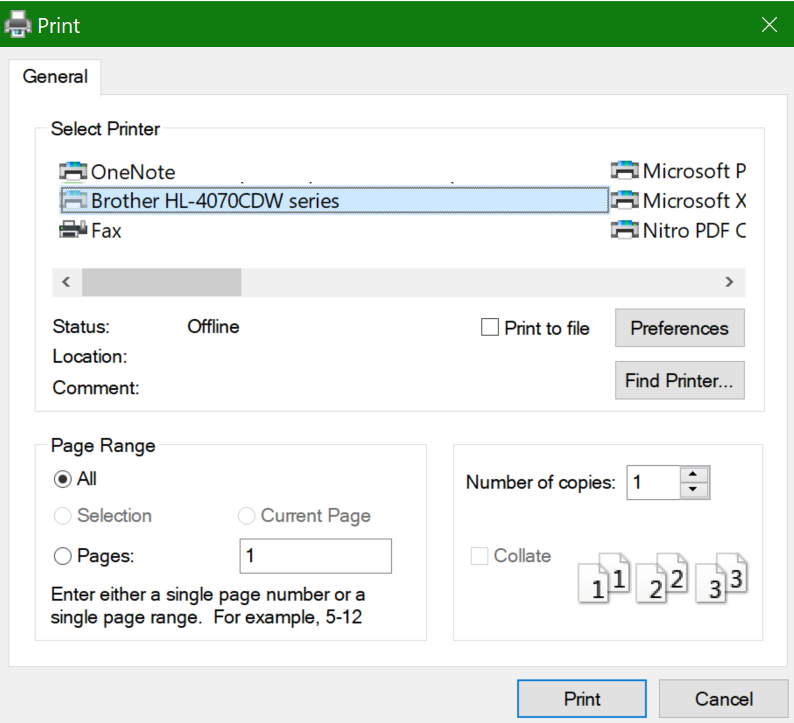

# Drukāšana uz abām papīra pusēm (dupleksā druka)Printing on both sides of paper (duplex printing)

**Vai mans printeris spēj divpusējā druka?****Is my printer capable of duplex printing?**

Printera līdzekļu kopsavilkumā vai rokasgrāmatā ir jāpasaka, vai tas spēj iespiest uz abām papīra pusēm, ko dēvē arī par "duplekso druku".Your printer’s feature summary or manual should tell you whether it is capable of printing on both sides of the paper, also known as “duplex printing.” Ja lietojat Microsoft Office, cits veids, kā to noskaidrot, ir atvērt Office lietojumprogrammu, piemēram, Word vai Excel, doties uz **failu > drukāt**, pārliecinoties, vai ir atlasīts pareizais printeris, un meklējat iespēju sadaļā iestatījumi.If you have Microsoft Office, another way to find out is by opening an Office app like Word or Excel, going to **File > Print**, making sure the right printer is selected, and looking for the capability in the Settings section. Piemērs:For example: 

**Dupleksa drukāšana programmā Microsoft Office****Duplex printing in Microsoft Office**

Ja printeris spēj drukāt abās pusēs, kad dodaties uz **failu > drukāt** Office lietojumprogrammā, tiek parādīta opcija "drukāt abās pusēs", kā parādīts piemērā.If your printer is capable of printing on both sides, when you go to **File > Print** in the Office app, you will see an option to “Print on Both Sides,” as shown in the example above.  Atlasiet vajadzīgo abpusējās drukas veidu (apvērst uz garās malas vai apvērst uz īso malu) un noklikšķiniet uz **Drukāt** , lai sāktu izdruku.Select the type of duplex printing you want (flip on long edge, or flip on short edge), and click **Print** to start the printout.

**Duplekso drukāšanu no jebkuras lietojumprogrammas****Duplex printing from any application**

Daudzās programmās, drukājot jūs redzēsiet General Print dialogs, kas izskatās šādi:In many apps when you print you will see a general print dialog that looks like this: 

Pārliecinieties, vai ir atlasīts pareizais printeris, un pēc tam noklikšķiniet uz **Preferences** , lai atvērtu printera preferenču logu.Make sure the right printer is selected, then click **Preferences** to open the printer preferences window. Ja printeris spēj dupleksā drukāšana, šajā logā tiks rādīta iespēja iespējot šo pašreizējo drukas darbu.If the printer is capable of duplex printing, the ability to enable this for the current print job will show in that window.
