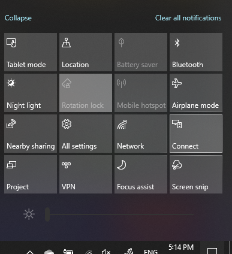

# Projicē datorā

Savā mērķa ierīcē (projicēšana uz) meklējiet "Projekcijas iestatījumi", lai atvērtu **Projecting šajā** datorā iestatījumu lapu . Pēc tam pārliecinieties, vai:
- "Dažas Windows un Android ierīces var projicēt šajā datorā, ja tiek runāts, ka tā ir labi" nolaižamā izvēlne ir iestatīta uz **Vienmēr izslēgt.**
- Nolaižamā izvēlne "Lūgt projicēt šajā datorā" ir iestatīta uz **Katru reizi, kad ir nepieciešams savienojums.**
- Nolaižamā izvēlne "Pieprasīt PIN savienošanai pārī" ir iestatīta uz **Nekad**.

Mērķa ierīcē palaidiet programmu **Connect, dodoties** uz Sākums **un meklējiet** "Izveidot savienojumu".

Pēc tam avota ierīcē, no kuras vēlaties projic veikt projicu:

1. Nospiediet **Windows taustiņu un A,** lai atvērtu darbību centru.
2. Noklikšķiniet **uz Izveidot savienojumu**.
3. Noklikšķiniet uz ierīces, uz kuru projicēsiet ekrānu.

Pēc iepriekš minētajām darbībām mērķa ierīcei vajadzētu parādīt avota ierīces ekrānu tā, it kā tas būtu sekundārais monitors.
