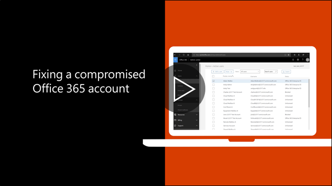

# Ieteicamās darbības, kas jāveic, ja konts ir apdraudēts

  
1. [Lietotāja paroles atiestatīšana](https://support.office.com/article/7a5d073b-7fae-4aa5-8f96-9ecd041aba9c) nekavējoties. Nekomunicē gala lietotājam jaunu paroli caur e-pastu. 
    
2. Noņemt jebkuru aizdomīgu [pārsūtīšanai adreses](https://support.office.com/article/ab5eb117-0f22-4fa7-a662-3a6bdb0add74) pastkastes līmenī. 
    
3. Noņemt jebkuru aizdomīgu [Iesūtnes kārtulas](https://support.office.com/article/1433E3A0-7FB0-4999-B536-50E05CB67FED) , kas atrodas pastkastē. 
    
4. Ja lietotājs ir bloķēts no nosūtīšanas e-pasta adresi, [dodieties uz ierobežotiem lietotājiem, lai atbloķētu kontu](https://protection.office.com/?hash=/restrictedusers). Pēc tam, kad izdarīts, lietotājam ir jābūt iespējai atsākt sūtīšanu ziņojumus 1 stundas laikā.
    
5. Noņemt lietotāja kontā jebkuru [administratīvo lomu grupas](https://support.office.com/article/eac4d046-1afd-4f1a-85fc-8219c79e1504) , līdz esat pārliecināts, ka konts vairs nav apdraudēta. 
    
Lai nākotnē samazinātu iespējamo datu pārkāpumu vai apdraudēta kontu, ieteicams izlasīt mūsu [biroja 365 drošības labāko praksi pants](https://support.office.com/article/9295e396-e53d-49b9-ae9b-0b5828cdedc3).
  

