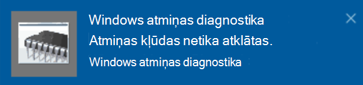

# Windows atmiņas diagnostikas palaišana operētājsistēmā Windows 10

Ja jūsu datorā operētājsistēma Windows un programmas avarē, sasalst vai darbojas nestabilā veidā, iespējams, radusies problēma ar datora atmiņu (RAM). Varat palaist Windows atmiņas diagnostiku, lai meklētu problēmas saistībā ar datora RAM.

Uzdevumjoslas meklēšanas lodziņā ierakstiet atmiņas **diagnostika un** pēc tam atlasiet **Windows atmiņas diagnostika**. 

Lai palaistu diagnostiku, dators ir jārestartē. Varat restartēt tūlīt (lūdzu, vispirms saglabāt savu darbu un aizvērt atvērtos dokumentus un e-pasta ziņojumus) vai ieplānot diagnostikas automātisku pašanu nākamajā datora restartēšanas reizē:

Pēc datora restartēšanas automātiski tiek **palaists Windows atmiņas diagnostikas** rīks. Statuss un norise tiks parādītas, palaižot diagnostiku, un jums ir iespēja  atcelt diagnostiku, nospiežot tastatūras taustiņu ESC.

Kad diagnostika ir pabeigta, Windows tiks startēta kā parasti.
Uzreiz pēc restartēšanas, kad tiek parādīta darbvirsma,  uzdevumjoslā tiek parādīts paziņojums (blakus darbību centra ikonai), lai norādītu, vai ir atrastas atmiņas kļūdas. Piemēram:

Tālāk ir redzama darbību centra ikona.  

Un paziņojuma paraugs: 

Ja nepamanīāt paziņojumu,  varat atlasīt darbību centra ikonu  uzdevumjoslā, lai atvērtu darbību centru un skatītu ritināmu paziņojumu sarakstu.

Lai pārskatītu detalizētu informāciju, **ierakstiet notikums** uzdevumjoslas meklēšanas lodziņā un pēc tam atlasiet **Notikumu skatītājs**. Notikumu **skatītāja** kreisajā rūtī naviģējiet uz **Windows žurnālus > sistēmu**. Labajā rūtī noskenējiet sarakstu, vienlaikus aplūkojot kolonnu Avots, līdz tiek atvērts notikums ar avota vērtību **MemoryDiagnostics-Results.**  Iezīmējiet katru šādu notikumu un skatiet rezultātu informāciju lodziņā zem **cilnes** Vispārīgi zem saraksta.
