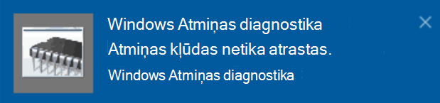

# Windows atmiņas diagnostikas palaišana operētājsistēmā Windows 10Run Windows Memory Diagnostics in Windows 10

Ja Windows un lietojumprogrammas datorā avarē, sasalst vai darbojas nestabilā veidā, var rasties problēmas ar datora atmiņu (RAM).If Windows and apps on your PC are crashing, freezing, or acting in an unstable manner, you may have a problem with the PC’s memory (RAM). Windows atmiņas diagnostiku var palaist, lai meklētu problēmas ar datora RAM.You can run the Windows Memory Diagnostic to check for problems with the PC’s RAM.

Uzdevumjoslas meklēšanas lodziņā ierakstiet **atmiņas diagnostika**un pēc tam atlasiet **Windows atmiņas diagnostika**.In the search box on your taskbar, type **memory diagnostic**, and then select **Windows Memory Diagnostic**. 

Lai palaistu diagnostiku, DATORAM ir jārestartē.To run the diagnostic, the PC needs to restart. Jums ir iespēja nekavējoties restartēt (Lūdzu, saglabājiet savu darbu un aizveriet atvērtos dokumentus un e-pasta ziņojumus vispirms) vai ieplānojiet diagnostiku, lai tas tiktu palaists automātiski nākamajā datora restartēšanas reizē.You have the option to restart immediately (please save your work and close open documents and e-mails first), or schedule the diagnostic to run automatically the next time the PC restarts:

Kad dators tiek restartēts, **Windows atmiņas diagnostikas rīks** darbosies automātiski.When the PC restarts, the **Windows Memory Diagnostics Tool** will run automatically. Status un progress tiks parādīts kā diagnostika palaist, un jums ir iespēja atcelt diagnostiku, hitting **ESC** taustiņu uz klaviatūras.Status and progress will be displayed as the diagnostics run, and you have the option of cancelling the diagnostics by hitting the **ESC** key on your keyboard.

Kad diagnostika ir pabeigta, sistēma Windows tiks startēta kā parasti.When the diagnostics are complete, Windows will start normally.
Uzreiz pēc restartēšanas, kad tiek parādīta darbvirsma, tiek parādīts paziņojums (blakus **darbību centra** ikonai uzdevumjoslā), lai norādītu, vai ir atrastas atmiņas kļūdas.Immediately after restart, when the Desktop appears, a notification will appear (next to the **Action Center** icon on the taskbar), to indicate whether any memory errors were found. Piemērs:For example:

Šeit ir darbību centra ikona:Here's the Action Center icon:  

Un paziņojuma paraugs:And a sample notification: 

Ja esat izlaidis paziņojumu, uzdevumjoslā varat atlasīt **darbību centra** ikonu, lai parādītu **darbību centru** un skatītu ritināmo paziņojumu sarakstu.If you missed the notification, you can select the **Action Center** icon  on the taskbar to display the **Action Center** and see a scrollable list of notifications.

Lai pārskatītu detalizētu informāciju, uzdevumjoslas meklēšanas lodziņā ierakstiet **notikums** un pēc tam atlasiet **notikumu skatītājs**.To review detailed information, type **event** into the search box on your taskbar, and then select **Event Viewer**. **Notikumu skatītāja**kreisajā rūtī naviģējiet uz **Windows žurnālu > sistēmu**.In the **Event Viewer**’s left-hand pane, navigate to **Windows Logs > System**. Labajā rūtī skenējiet sarakstu, aplūkojot **avota** kolonnu, līdz brīdim, kad tiek parādīts notikumi ar avota vērtību **memorydiagnostics-rezultāti**.In the right-hand pane, scan down the list while looking at the **Source** column, until you see events with Source value **MemoryDiagnostics-Results**. Izcelt katru šādu notikumu un redzēt rezultātu informāciju ailē zem cilnes **Vispārīgi** zem saraksta.Highlight each such event and see the result information in the box under the **General** tab below the list.
