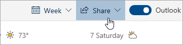

# Koplietošana ar Outlook tīmeklī

Kalendāra lapas augšdaļā labajā rīkjoslā atlasiet Kopīgot **un izvēlieties**kalendāru, kuru vēlaties kopīgot.

    

**Piezīme.** Nevar kopīgot kalendārus, kas pieder citām personām.

- Ievadiet tās personas vārdu vai e-pasta adresi, ar kuru vēlaties kopīgot kalendāru.
- Izvēlieties, kā personai jāizmanto jūsu kalendārs:
    - **Var skatīt, kad esmu aizņemts**   ļauj viņiem redzēt, kad esat aizņemts, bet neietver detalizētu informāciju, piemēram, notikuma atrašanās vietu.
    - **Var skatīt virsrakstus un atrašanās vietas**   ļauj viņiem redzēt, kad esat aizņemts, kā arī nosaukumu un atrašanās vietu notikumiem.
    - **Var skatīt visu informāciju**   ļauj viņiem redzēt visu informāciju par jūsu notikumiem.
    - **Var rediģēt**   rediģēt kalendāru.
    - **Deleģēt**   rediģēt kalendāru un kopīgot to ar citiem.
- Izvēlieties **Kopīgot**.
