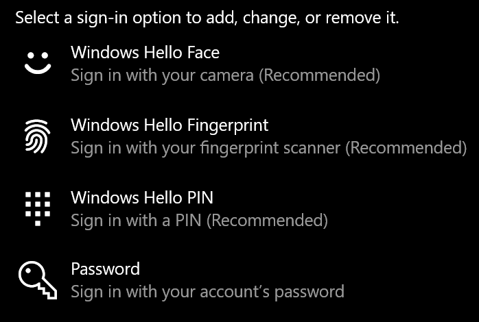
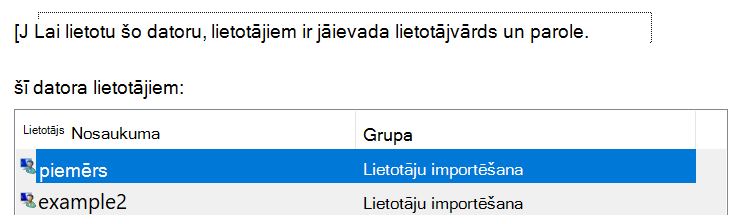

# Pierakstīšanās operētājsistēmā Windows 10, neizmantojot paroliSign-in to Windows 10 without using a password

Lai izvairītos no paroles rakstīšanas Windows startēšanas laikā, ieteicams izmantot kādu no Windows Hello drošās pierakstīšanās opcijām, piemēram, PIN, sejas atpazīšanas vai pirksta nospiedumu, ja tas ir pieejams.To avoid having to type a password at Windows startup, we recommend you use one of the Windows Hello secure sign-in options, like a PIN, face recognition, or fingerprint, if available. Ja tiešām vēlaties atspējot drošo pierakstīšanos, skatiet tālāk sniegtos norādījumus "automātiski pierakstīties Windows 10".If you really want to disable secure sign-in, see the "Automatically sign in to Windows 10" instructions below.

**Secure Windows Hello alternatīvas konta paroli****Secure Windows Hello alternatives to the account password**

Dodieties uz **iestatījumi > konti > pierakstīšanās opcijas** (vai noklikšķiniet [šeit](ms-settings:signinoptions?activationSource=GetHelp)).Go to **Settings  > Accounts > Sign-in options** (or click [here](ms-settings:signinoptions?activationSource=GetHelp)). Tiks uzskaitītas pieejamās pierakstīšanās opcijas.Available sign-in options will be listed. Piemērs:For example:

Noklikšķiniet uz vai pieskarieties kādai no opcijām, lai to konfigurētu.Click or tap one of the options to configure it. Nākamreiz startējot vai atbloķējot sistēmu Windows, paroles vietā varēs izmantot jauno opciju.Next time you start or unlock Windows, you will be able to use the new option instead of a password. 

**Automātiski pierakstīties Windows 10****Automatically sign-in to Windows 10**

**Piezīme**: automātiska pierakstīšanās ir ērta, bet ievieš drošības risku, it īpaši, ja jūsu dators ir pieejams vairākiem cilvēkiem.**Note**: Automatic sign-in is convenient, but introduces a security risk, especially if your PC is accessible by multiple people. 

1. Uzdevumjoslā noklikšķiniet uz pogas **Sākt** vai pieskarieties tai.Click or tap the **Start** button in the Taskbar.

2. Ierakstiet **lodziņā netplwiz** un nospiediet taustiņu ENTER, lai atvērtu logu lietotāju konti.Type **netplwiz** and hit the Enter key to open the User Accounts window.

3. **Lietotāju kontos**noklikšķiniet uz konta, kurā vēlaties automātiski pierakstīties, startējot sistēmu Windows.In **User Accounts**, click the account you want to automatically sign in to when Windows starts.

4. Noņemiet atzīmi no izvēles rūtiņas "lietotājiem ir jāievada lietotājvārds un parole, lai izmantotu šo datoru".Uncheck the "Users must enter a user name and password to use this computer" checkbox.

    

5. Noklikšķiniet uz **Labi**.Click **OK**. Jums tiks lūgts ievadīt un apstiprināt paroli atlasītajam kontam.You will be asked to enter and confirm the password for the account you selected. Noklikšķiniet uz **Labi** , lai pabeigtu.Click **OK** to finish. Nākamreiz, kad tiks startēta operētājsistēma Windows 10, tā automātiski pierakstīsies atlasītajā kontā.Next time Windows 10 starts, it will automatically sign in to the account you selected.
