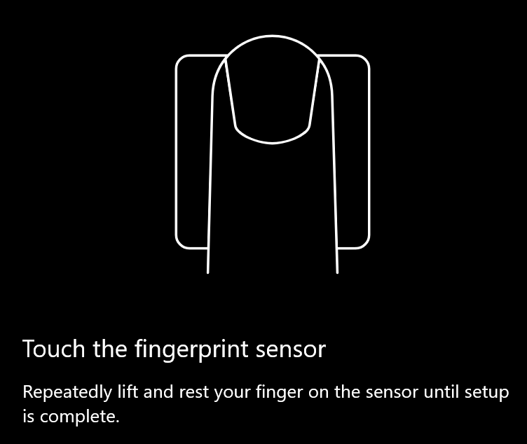
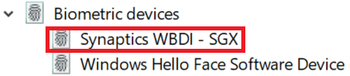

# Izmantojiet pirkstu nospiedumu atbloķēšanas opciju operētājsistēmā Windows 10Use fingerprint unlock option in Windows 10

**Iespējot Windows Hello pirksta nospiedumu****Enable Windows Hello Fingerprint**

Lai atbloķētu operētājsistēmu Windows 10, izmantojot pirksta nospiedumu, ir jāiestata Windows Hello pirksta nospiedums, pievienojot (ļaujot Windows iemācīties atpazīt) vismaz vienu pirkstu.To unlock Windows 10 using your fingerprint, you need to set up Windows Hello Fingerprint by adding (letting Windows learn to recognize) at least one finger. 

1. Dodieties uz **iestatījumi > konti > pierakstīšanās opcijas** (vai noklikšķiniet [šeit](ms-settings:signinoptions?activationSource=GetHelp)).Go to **Settings  > Accounts > Sign-in options** (or click [here](ms-settings:signinoptions?activationSource=GetHelp)). Tiks uzskaitītas pieejamās pierakstīšanās opcijas.Available sign-in options will be listed. Piemērs:For example:

    

2. Noklikšķiniet uz vai pieskarieties **Windows Hello pirksta nospiedums**, pēc tam noklikšķiniet uz **Iestatīt**.Click or tap **Windows Hello Fingerprint**, then click **Set up**. Windows Hello iestatīšanas logā noklikšķiniet uz **Sākt darbu**.In the Windows Hello setup window, click **Get started**. Pirkstu nospiedumu sensors aktivizēs, un jums tiks lūgts novietot pirkstu uz sensora:The fingerprint sensor will activate, and you'll be asked to place your finger on the sensor:

   

3. Izpildiet norādījumus, kas prasīs atkārtoti skenēt pirkstu.Follow the instructions, which will ask you to repeatedly scan your finger. Kad tas ir izdarīts, jums būs iespēja pievienot citus pirkstus, kurus jūs varētu vēlēties izmantot pierakstīšanās gadījumā.When this is finished, you'll have the option of adding other fingers you may want to use for sign-in. Nākamreiz, kad pierakstīsies operētājsistēmā Windows 10, jums būs iespēja izmantot pirksta nospiedumu.Next time you sign in to Windows 10, you will have the option of using your fingerprint to do so.

**Windows Hello pirksta nospiedums nav pieejams kā pierakstīšanās opcija****Windows Hello Fingerprint not available as a sign-in option**

Ja Windows Hello pirksta nospiedums nav redzams kā opcija **pierakstīšanās opcijas**, tas nozīmē, ka Windows nav informēts par jebkuru pirkstu nospiedumu lasītāju/skeneri, kas ir pievienots datoram, vai arī sistēmas politika liedz tās izmantošanu (piemēram, ja jūsu datoru pārvalda darbvieta).If Windows Hello Fingerprint is not shown as an option in **Sign-in options**, it means Windows is not aware of any fingerprint reader/scanner attached to your PC, or that a system policy prevents its use (if for example your PC is managed by your workplace). Lai novērstu:To troubleshoot: 

1. Uzdevumjoslā atlasiet pogu **Sākums** un meklējiet **ierīču pārvaldnieks**.Select the **Start** button in the Taskbar and search for **Device Manager**.

2. Noklikšķiniet uz vai pieskarieties, lai atvērtu **ierīču pārvaldnieku**.Click or tap to open **Device Manager**.

3. Ierīču pārvaldniekā izvērsiet sadaļu biometrijas ierīces, noklikšķinot uz tās Chevron.In Device Manager, expand Biometric devices by clicking its chevron.

   

4. Jūsu pirkstu nospiedumu skeneris ir jānorāda kā biometriskā ierīce, piemēram, Synaptics WBDI Scanner:Your fingerprint scanner should be listed as a biometric device, such as the Synaptics WBDI scanner:

   

5. Ja pirkstu nospiedumu skeneris netiek rādīts un skeneris ir integrēts datorā, apmeklējiet datora ražotāja vietni.If your fingerprint scanner is not shown, and the scanner is integrated into your PC, go to the PC manufacturer's website. DATORA modeļa sadaļā tehniskā palīdzība meklējiet skenera Windows 10 draiveri, ko varat instalēt.In the technical support section for your PC model, search for a Windows 10 driver for a scanner that you can install.

6. Ja skeneris ir atdalīts no datora (pievienots, izmantojot USB), apmeklējiet skenera ražotāja vietni, lai atrastu un instalētu Windows 10 ierīces draivera programmatūru savam skenera modelim.If the scanner is separate from the PC (attached via USB), go to the scanner manufacturer's website to find and install Windows 10 device driver software for the scanner model you have.
