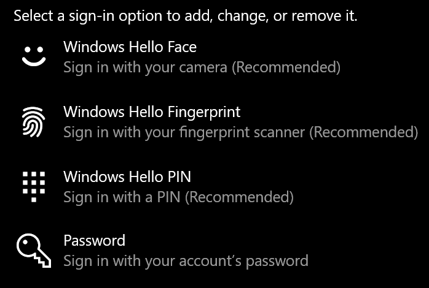

# Pirkstu nospiedumu atbloķēšanas opcijas izmantošana Windows 10

**Iespējot Windows Hello nospiedumu**

Lai atbloķētu Windows 10, izmantojot pirksta nospiedumu, jums ir jāiestata pirksta nospieduma Windows Hello vismaz vienu pirkstu, lai to Windows atpazītu. 

1. Dodieties **Iestatījumi > konta > pierakstīšanās opcijām (vai** noklikšķiniet [šeit).](ms-settings:signinoptions?activationSource=GetHelp) Tiks uzskaitītas pieejamās pierakstīšanās opcijas. Piemēram:

    

2. Noklikšķiniet uz vai **pieskarieties Windows Hello pirksta nospiedumu** un pēc tam **noklikšķiniet uz Iestatīt**. Iestatīšanas Windows Hello dialoglodziņā noklikšķiniet uz **Sākt darbu.** Tiks aktivizēts pirkstu nospiedumu sensors, un jums tiks lūgts novietot pirkstu uz sensora:

   

3. Izpildiet norādījumus, kas lūgs atkārtoti skenēt pirkstu. Kad tas ir izdarīts, varat pievienot citus pirkstus, kurus, iespējams, vēlēsities izmantot, lai pierakstītos. Nākamreiz, kad pierakstīs Windows 10, jums būs iespēja to izdarīt, izmantojot pirksta nospiedumu.

**Windows Hello Pirksta nospiedumu nav pieejama kā pierakstīšanās opcija**

Ja Windows Hello pirksta nospieduma opcija netiek rādīta kā opcija pierakstīšanās opcijās, tas nozīmē, ka programma Windows nezina, vai pirkstu nospiedumu lasītājs/skeneris nav pievienots jūsu datoram vai arī sistēmas politika neļauj to izmantot (piemēram, jūsu datoru pārvalda jūsu darbavieta). Lai novērstu problēmas, 

1. **Uzdevumjoslā** atlasiet pogu Sākums un meklējiet **Ierīču pārvaldnieks**.

2. Noklikšķiniet uz vai pieskarieties, lai **atvērtu ierīču pārvaldnieku**.

3. Ierīču pārvaldniekā izvērsiet biometriskās ierīces, noklikšķinot uz tās skujiņas.

   

4. Jūsu pirkstu nospiedumu skenerim ir jābūt norādītam kā biometriskai ierīcei, piemēram, sinaptikas WBDI skenerim:

   

5. Ja jūsu pirkstu nospiedumu skeneris nav redzams un skeneris ir integrēts jūsu datorā, dodieties uz datora ražotāja tīmekļa vietni. Datora modeļa tehniskā atbalsta sadaļā meklējiet datora draiveri, Windows 10 skeneri, ko varat instalēt.

6. Ja skeneris nav dators (pievienots, izmantojot USB), dodieties uz skenera ražotāja tīmekļa vietni, lai atrastu un instalētu Windows 10 ierīces draivera programmatūru jūsu skenera modelim.
