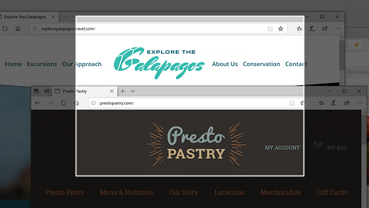
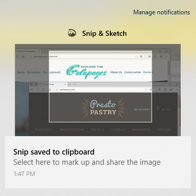

# Izgriezuma un & izmantošana, lai tvertu, atzīmētu un koplietotu attēlusUse Snip & Sketch to capture, mark up, and share images

Ekrāna skici tagad sauc par **izgriezumu & skici.**Screen sketch is now called **Snip & Sketch**. **Lai ātri izveidotu izgriezuma griezumu:****To quickly take a snip**:

1. Nospiediet **Windows logotipa taustiņu + Shift + S.** Jūsu ekrāns būs tumšāks un kursors būs redzams kā krusts.Press the **Windows logo key + Shift + S**. You'll see your screen darken and your cursor displayed as a cross. 

2. Izvēlieties punktu kopēamā apgabala malā un ar peles kreiso pogu noklikšķiniet uz kursora.Choose a point at the edge of the area you want to copy and left-click the cursor. 

3. Novietojiet kursoru, lai iezīmētu apgabalu, ko vēlaties tvert.Move your cursor to highlight the area you want to capture. Tvertā vieta tiks parādīta ekrānā.The area you capture will appear on your screen.

   

Izgriešanas attēls tiek saglabāts starpliktuvē un ir gatavs ielīmēšanai e-pasta ziņojumā vai dokumentā.The image you snipped is saved to your clipboard, ready for pasting into an email or document. 

**Ja vēlaties rediģēt vai skatīt attēlu:****If you want to edit or view the image**: 

- Noklikšķiniet uz paziņojumu ikonas uzdevumjoslas labajā malā; pēc tam noklikšķiniet uz tikko tvertā attēla.Click the notifications icon at the far right side of the taskbar; then click the picture you have just captured. Izgriezums tiek atvērts programmā & Skice.Your snip opens in the Snip & Sketch app.

   
