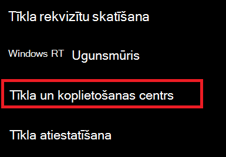
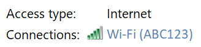
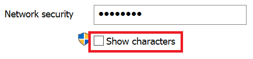

# Skatiet Wi-Fi tīkla paroli programmā Windows 10

1. Pārliecinieties, vai Windows 10 datoram ir izveidots savienojums Wi-Fi tīklu.

2. Dodieties **uz Iestatījumi > Tīkla & Interneta > statuss** vai noklikšķiniet vai  pieskarieties šeit, lai ļautu mums doties šeit tūlīt.)

3. Noklikšķiniet **uz Tīkla un koplietošanas centrs**.

    

4. Sadaļā **Network and Sharing Center**(Tīkls un koplietošanas centrs) blakus **Connections**(Savienojumi) redzēsit sava bezvadu tīkla nosaukumu. Piemēram, ja jūsu tīkla nosaukums ir "ABC123", varat redzēt:

    

    Noklikšķiniet uz bezvadu tīkla nosaukuma, lai Wi-Fi statusa logu. 

5. Loga Statuss Wi-Fi Bezvadu rekvizīti **noklikšķiniet** uz cilnes **Drošība** un atzīmējiet Rādīt **rakstzīmes**.

    

